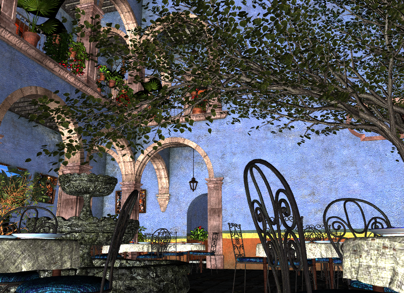

[](https://opensource.org/licenses/MIT)

# Spinning Mug
I'm creating a Vulkan renderer from scratch to learn graphic programming.



## Features
* Phong shading
* Normal mapping
* Point light, spot light, directional light
* Texture mapping

## Dependencies
* [glfw](https://github.com/glfw/glfw)
* [imgui](https://github.com/ocornut/imgui)
* [stb](https://github.com/nothings/stb)
* [glm](https://github.com/g-truc/glm)

## Building
Tested on: Windows 11 Pro version 23H2

Prerequisites
* MSVC 19.00 or higher
* CMake 2.8 or higher
* Vulkan SDK 1.3.280.0 or higher

```
git clone --recursive https://github.com/datnx/spinning-mug.git
cd spinning-mug
mkdir build
cmake -S . -B build
```

## Usage
1. Follow the build instructions and generate spinning-mug.exe.
1. Download the latest release [here](https://github.com/datnx/spinning-mug/releases/download/v0.3/spinning-mug-v0.3.1.zip).
2. Extract and copy config and 3d_models folders to the root of the cloned repo.
3. Run spinning-mug.exe through Visual Studio.

## Controls
* `W`/`A`/`S`/`D` - camera movement.
* `Mouse` - move to look around.
* `T` - toggle UI.
* `ESC` - close application.

## License
```
Copyright (c) 2024 Dat Nguyen

Permission is hereby granted, free of charge, to any person obtaining a copy of this software and 
associated documentation files (the "Software"), to deal in the Software without restriction, 
including without limitation the rights to use, copy, modify, merge, publish, distribute, sublicense,
and/or sell copies of the Software, and to permit persons to whom the Software is furnished to do so, 
subject to the following conditions:

The above copyright notice and this permission notice shall be included in all copies or substantial
portions of the Software.

THE SOFTWARE IS PROVIDED "AS IS", WITHOUT WARRANTY OF ANY KIND, EXPRESS OR IMPLIED, INCLUDING BUT NOT 
LIMITED TO THE WARRANTIES OF MERCHANTABILITY, FITNESS FOR A PARTICULAR PURPOSE AND NONINFRINGEMENT. 
IN NO EVENT SHALL THE AUTHORS OR COPYRIGHT HOLDERS BE LIABLE FOR ANY CLAIM, DAMAGES OR OTHER LIABILITY,
WHETHER IN AN ACTION OF CONTRACT, TORT OR OTHERWISE, ARISING FROM, OUT OF OR IN CONNECTION WITH THE 
SOFTWARE OR THE USE OR OTHER DEALINGS IN THE SOFTWARE.
```